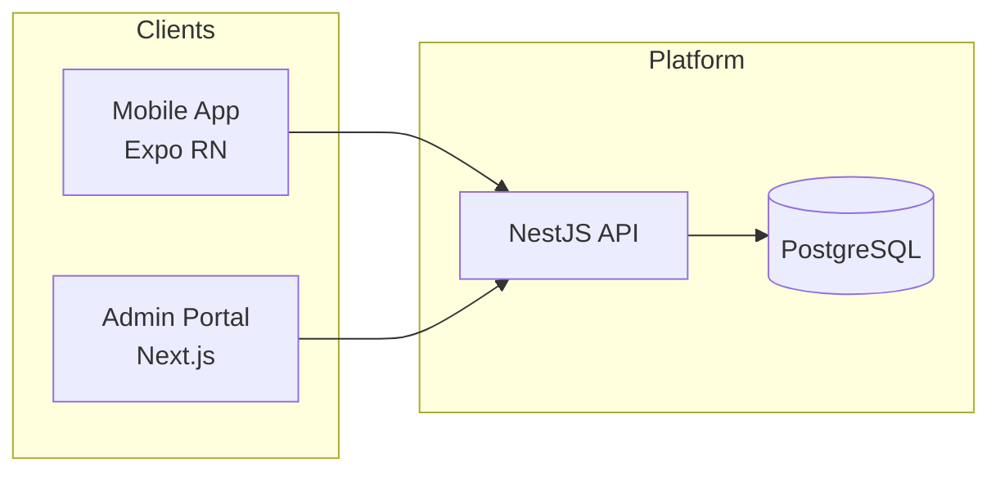

# Architecture

## System context

## Monorepo layout

| Package | Responsibility |
| ------- | -------------- |
| `mobile/` | Student-facing mobile application |
| `backend/` | REST/GraphQL API, business logic, Prisma data access |
| `admin/` | Internal admin and moderation UI |

## Backend module strategy (NestJS)

- `src/modules/` — feature modules (auth, users, discussions, etc.) added per sprint
- `src/common/` — shared decorators, guards, filters, pipes
- `src/database/prisma/` — Prisma client lifecycle
- `src/config/` — typed configuration
- `src/health/` — liveness/readiness endpoints

## Cross-cutting concerns (planned)

- Authentication & authorization
- Logging and observability
- Rate limiting
- File storage (if needed)
- Background jobs

## Related documents

- [Database](../database/README.md)
- [API](../api/README.md)
- [ADRs](../decisions/README.md)
- [Environment variables](../development/environment-variables.md)
