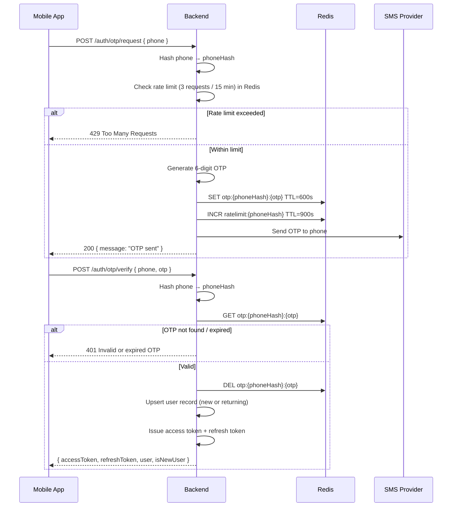
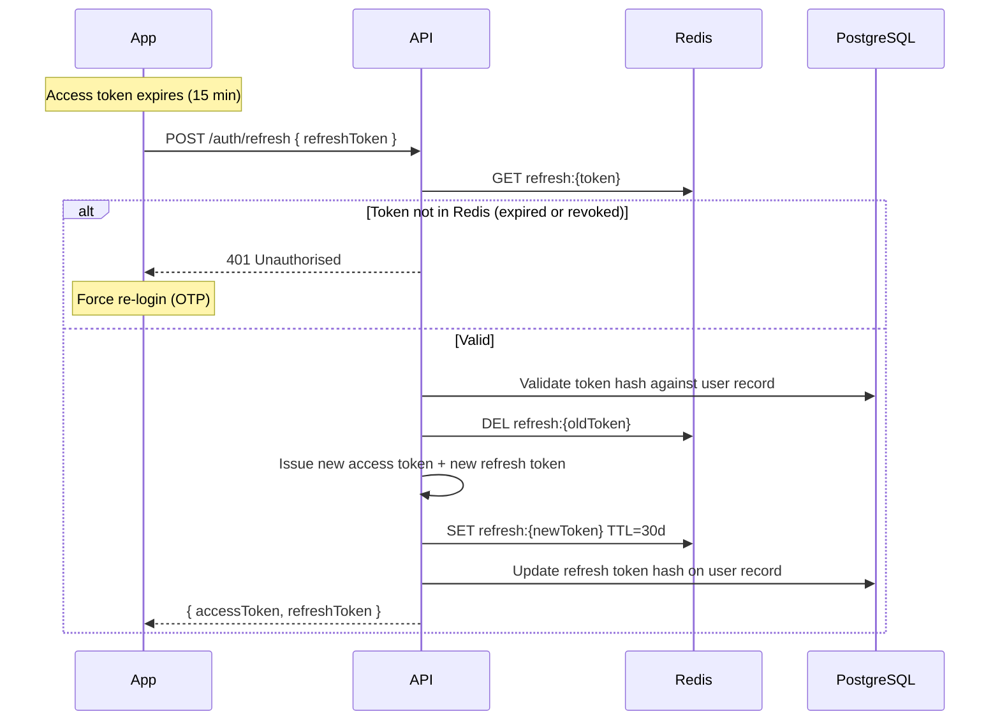

# MedConnect — Security Model v1

**Version:** 1.0  
**Status:** Draft  
**Date:** 2026-06-09  
**Owner:** Engineering / Security

---

## 1. Security Philosophy

MedConnect is built on a fundamental tension: we must **verify real identities** to produce trustworthy content, while **protecting those identities** in public to enable honest discourse. The security model is designed around three principles:

1. **Verify the credential, anonymise the person** — we know who you are; the public does not.
2. **Least privilege by default** — every user can only access what their role explicitly permits.
3. **Trust is earned incrementally** — posting privileges expand as verification is completed.

---

## 2. Anonymous Identity Model

### Identity layers

```
┌─────────────────────────────────────────────────────┐
│  Layer 1 — Cryptographic identity (server-only)     │
│  Phone number (hashed), user UUID                   │
│  Never exposed to clients                           │
├─────────────────────────────────────────────────────┤
│  Layer 2 — Verified credential (admin-visible only) │
│  Real name, institution, document scans             │
│  Accessible only by Admin role                      │
├─────────────────────────────────────────────────────┤
│  Layer 3 — Role label (public)                      │
│  "Verified 3rd Year Student, XYZ College"           │
│  "Verified Alumni, ABC College, Batch 2021"         │
│  No personal identifiers                            │
├─────────────────────────────────────────────────────┤
│  Layer 4 — Display name (public, user-controlled)   │
│  Pseudonym; no real name required                   │
│  Cannot impersonate institutions or real people     │
└─────────────────────────────────────────────────────┘
```

### Phone number handling

- Phone numbers are stored as a **bcrypt hash** in the `users` table — never in plaintext.
- For OTP lookup: a separate Redis key `otp:<hash>:<otp>` with 10-minute TTL; no plaintext phone in PostgreSQL.
- When a user deletes their account, the hash is zeroed out and a tombstone record retained for audit.

### What is never publicly exposed

| Data point | Exposed? | Notes |
|------------|----------|-------|
| Real name | No | Stored encrypted; admin-only |
| Phone number | No | Hashed; not retrievable |
| University-specific account ID | No | Used for verification only |
| Document scans | No | Private S3 bucket; pre-signed admin-only URLs |
| IP address | No | Logged server-side for abuse; never in API responses |
| Device identifiers | No | Push tokens stored; not surfaced in API |

---

## 3. Access Control Model

### Roles

| Role | Code | Description |
|------|------|-------------|
| Unauthenticated | — | Read-only public university data |
| Prospective Student | `PROSPECTIVE` | Browse, post questions anonymously, initiate chats |
| Current Student (unverified) | `STUDENT_UNVERIFIED` | Same as PROSPECTIVE; verification pending |
| Current Student (verified) | `STUDENT_VERIFIED` | Answer questions, post reviews, accept chats |
| Alumni (unverified) | `ALUMNI_UNVERIFIED` | Same as PROSPECTIVE |
| Alumni (verified) | `ALUMNI_VERIFIED` | Answer questions, post reviews, accept chats |
| Moderator | `MODERATOR` | View reports, action content (admin portal only) |
| Admin | `ADMIN` | All moderator rights + user management + verification review |
| Super Admin | `SUPER_ADMIN` | All admin rights + admin user management |

### Permission matrix

| Action | PROSPECTIVE | STUDENT_VERIFIED | ALUMNI_VERIFIED | MODERATOR | ADMIN |
|--------|-------------|-----------------|-----------------|-----------|-------|
| View university profiles | ✓ | ✓ | ✓ | ✓ | ✓ |
| Post a question | ✓ | ✓ | ✓ | — | — |
| Post an answer | — | ✓ | ✓ | — | — |
| Post a review | — | ✓ | ✓ | — | — |
| Upvote content | ✓ | ✓ | ✓ | — | — |
| Initiate chat | ✓ | — | — | — | — |
| Accept chat | — | ✓ (if available) | ✓ (if available) | — | — |
| Submit verification | ✓ (as student/alumni) | — | — | — | — |
| View own reports | ✓ | ✓ | ✓ | — | — |
| View moderation queue | — | — | — | ✓ | ✓ |
| Action content (remove) | — | — | — | ✓ | ✓ |
| Review verification queue | — | — | — | — | ✓ |
| Manage users | — | — | — | — | ✓ |
| Manage universities | — | — | — | — | ✓ |
| Manage admin users | — | — | — | — | SUPER_ADMIN |

### Row-level security principles (enforced in service layer)

- Users can only read their own private data (verification documents, chat messages they're party to).
- Answers and reviews carry the `userId` FK but API responses strip it and return only the role label.
- Chat messages are only accessible to the two room members.
- Admin endpoints check `aud: admin` in the JWT and require an `ADMIN`/`MODERATOR`/`SUPER_ADMIN` role claim.

---

## 4. Document Protection

Verification documents (college IDs, degree certificates) are the most sensitive data in the system.

### Storage

- Stored in a **private S3-compatible bucket** with no public access policy.
- Object keys are UUIDs — not derived from user identity or document type.
- Bucket-level server-side encryption (AES-256) enabled.
- Bucket access logging enabled; alerts on anomalous GET patterns.

### Access flow

```mermaid
sequenceDiagram
    participant Admin
    participant API
    participant S3

    Admin->>API: GET /admin/verification/:id
    API->>API: Verify JWT aud=admin + role=ADMIN
    API->>S3: Generate pre-signed GET URL (5-minute TTL, specific object key)
    API-->>Admin: { documentUrl: "https://s3...?signed=...", expiresAt }
    Admin->>S3: GET document (direct, time-limited)
    Note over Admin,S3: URL expires in 5 min; not loggable by Admin client
```

### Retention and deletion

- Documents retained for **7 years** after account closure (regulatory requirement for credentialing).
- On account deletion: user record anonymised; document reference remains in `verification_requests` with a `deleted_at` tombstone.
- Purge job runs at 7-year mark to hard-delete S3 objects and DB records.

---

## 5. Mobile OTP Authentication Strategy

OTP is the sole primary authentication factor. Email/password is intentionally excluded from MVP.

### Flow



### OTP security properties

| Property | Value |
|----------|-------|
| Length | 6 digits |
| TTL | 10 minutes |
| Max attempts | 5 (then require re-request) |
| Rate limit (requests) | 3 per phone per 15 minutes |
| Storage | Redis only (never PostgreSQL) |
| Transmission | Over HTTPS; never logged |
| Retry lockout | After 5 failed verifications, 30-minute lockout |

---

## 6. JWT Strategy

MedConnect uses short-lived access tokens to minimise the impact of token compromise.

### Token specification

| Property | Access Token | Admin Access Token |
|----------|-------------|-------------------|
| Algorithm | RS256 | RS256 |
| Issuer (`iss`) | `medconnect-api` | `medconnect-api` |
| Audience (`aud`) | `medconnect-app` | `medconnect-admin` |
| Expiry (`exp`) | 15 minutes | 15 minutes |
| Subject (`sub`) | User UUID | Admin User UUID |
| Custom claims | `role`, `verificationStatus` | `role` (ADMIN/MODERATOR/SUPER_ADMIN) |
| Signing key | RSA private key (2048-bit) | Same keypair, different `aud` |

### Token claims example

```json
{
  "iss": "medconnect-api",
  "aud": "medconnect-app",
  "sub": "user_cuid_here",
  "exp": 1749481200,
  "iat": 1749480300,
  "role": "STUDENT_VERIFIED",
  "verificationStatus": "APPROVED"
}
```

### Key management

- RSA private key stored as environment secret (not in code or `.env.example`).
- Public key exposed at `/.well-known/jwks.json` for client-side verification if needed.
- Key rotation: generate new keypair; run both old and new for 1 access-token TTL window (15 min) then retire old key.

---

## 7. Refresh Token Strategy

### Design



### Refresh token properties

| Property | Value |
|----------|-------|
| Format | Cryptographically random 256-bit hex string |
| Storage (server) | Redis (hashed with SHA-256) + PostgreSQL (hash only, for revocation) |
| Storage (client) | Secure encrypted storage (Expo SecureStore) |
| TTL | 30 days (rolling — renewed on each use) |
| Rotation | True rotation — each use issues a new token |
| Revocation | Redis DEL + PostgreSQL hash nulled (on logout or suspicious activity) |
| Max sessions | 5 concurrent devices per user (oldest revoked on overflow) |

### Logout

```
POST /auth/logout
→ Redis DEL refresh:{token}
→ PostgreSQL: null out refresh token hash for this device
→ Response: 204 No Content
```

### Suspicious activity response

If a refresh token is used after it has already been rotated (replay attack):
1. Immediately revoke **all** refresh tokens for that user.
2. Log security event.
3. Force full re-authentication on all devices.

---

## 8. Transport Security

| Layer | Requirement |
|-------|-------------|
| All API traffic | TLS 1.2+ (TLS 1.3 preferred) |
| WebSocket (chat) | WSS (WebSocket Secure) |
| S3 pre-signed URLs | HTTPS only; SigV4 signing |
| Admin portal | HTTPS + HSTS header |
| Certificate | Auto-renewed via Let's Encrypt or platform provider |
| HTTP → HTTPS | Redirect enforced at reverse proxy / CDN |

---

## 9. Threat Model Summary

| Threat | Mitigation |
|--------|-----------|
| Identity exposure of mentors | Role-label only in public APIs; real identity admin-only |
| Fake mentor verification | Manual admin review of every document; document expiry check |
| OTP brute force | Rate limiting + attempt lockout |
| Token theft | Short-lived access tokens (15 min); refresh token rotation; secure storage |
| Replay attack on refresh tokens | Token rotation detects reuse; full session revocation triggered |
| Malicious document upload | Content-type validation; virus scan on S3 event (future); private bucket |
| Privilege escalation | `aud` claim enforced; role checks in every guarded endpoint |
| Chat content exfiltration | TLS in transit; messages stored encrypted at rest (DB encryption) |
| Admin portal exposure | Separate `aud`; internal URL; no public app store distribution |
| Mass data extraction | Rate limiting on list endpoints; cursor-based pagination limits batch size |
