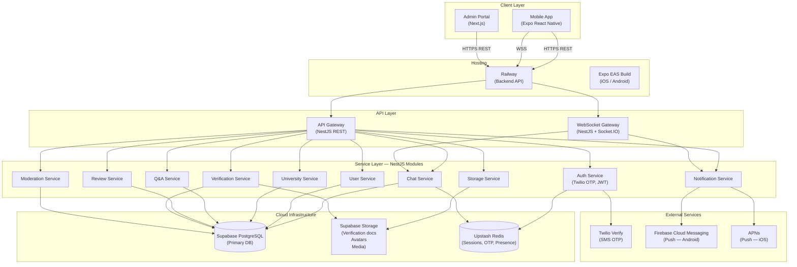
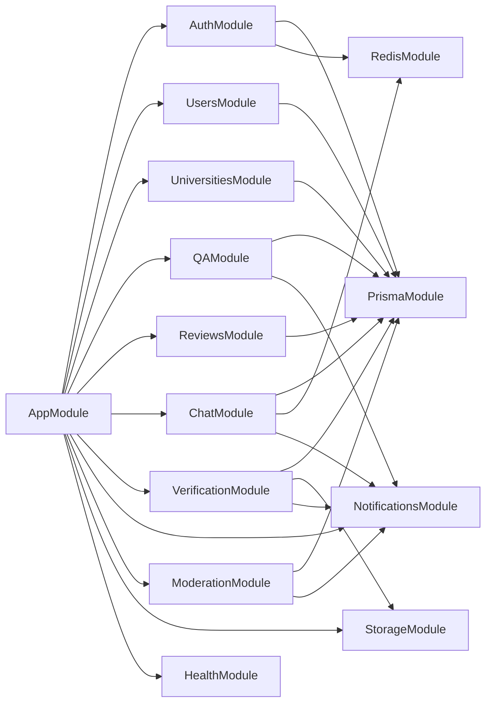
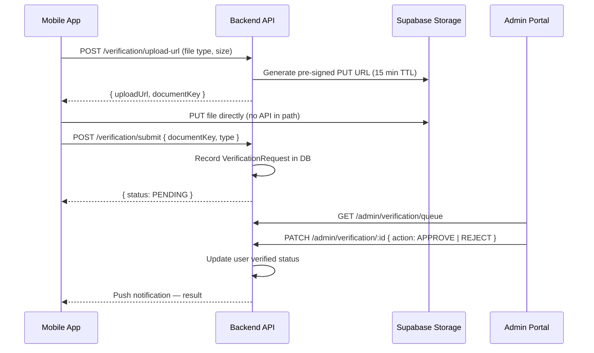
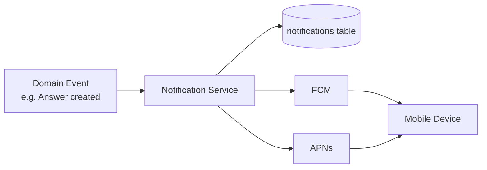
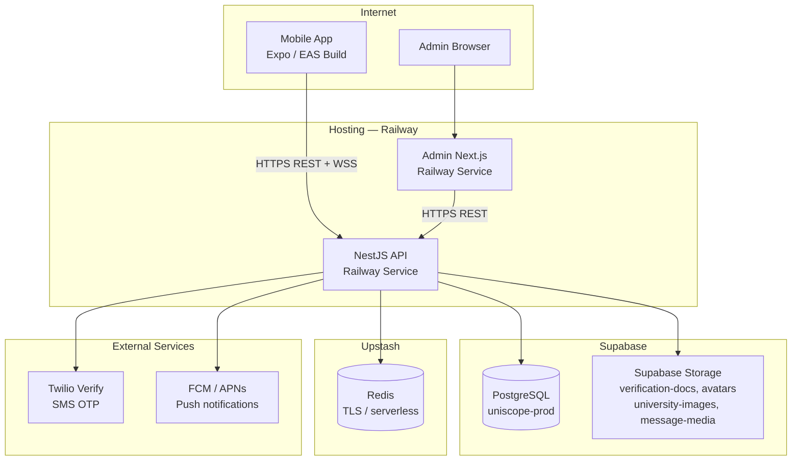

# Uniscope — System Architecture v1

**Version:** 1.1  
**Status:** Active  
**Date:** 2026-06-14  
**Owner:** Engineering

---

## 1. Architecture Overview

Uniscope is a mobile-first platform with a monolithic NestJS backend, Supabase PostgreSQL persistence, and a Next.js admin portal. The architecture is deliberately simple for the MVP — optimised for team velocity over horizontal scalability — with clear seams to evolve toward microservices or service extraction when warranted by growth.

All infrastructure is **cloud-first**: no local services are required for development. See [docs/infrastructure/cloud-services.md](../infrastructure/cloud-services.md) for details.



---

## 2. Mobile Application

**Technology:** React Native + Expo (TypeScript)  
**Distribution:** Expo EAS Build → App Store / Play Store

### Responsibilities
- Student and mentor-facing UI
- OTP authentication flow
- University discovery and search
- Q&A browsing and submission
- Review submission
- Real-time 1:1 chat (WebSocket)
- Push notification handling
- Verification document upload

### Key design decisions

| Decision | Choice | Rationale |
|----------|--------|-----------|
| Navigation | React Navigation (Stack + Bottom Tab) | Industry standard for Expo |
| State management | Zustand | Lightweight; no Redux boilerplate for MVP |
| API client | Axios with interceptors | Token refresh handling, error normalisation |
| Real-time | Socket.IO client | Matches backend gateway |
| Media upload | Direct-to-storage pre-signed URLs | Avoids routing large payloads through API |
| Offline | Optimistic UI for Q&A only | Chat requires connectivity |

### Module structure

```
mobile/src/
├── navigation/         # Stack, tab, and auth navigators
├── screens/
│   ├── auth/           # OTP request, OTP verify
│   ├── onboarding/     # Role selection, profile setup
│   ├── discovery/      # University list, university detail
│   ├── qa/             # Question list, question detail, ask question
│   ├── reviews/        # Review list, write review
│   ├── chat/           # Conversation list, chat room
│   ├── verification/   # Document upload, status
│   └── admin/          # (Admin app — separate entry point)
├── components/         # Shared UI: Avatar, Badge, Card, Input
├── services/           # API client, socket client, storage client
├── hooks/              # useAuth, useChat, useNotifications
├── stores/             # Zustand slices
├── types/              # Shared TypeScript types
└── utils/              # Formatters, validators, constants
```

---

## 3. Backend API

**Technology:** NestJS (TypeScript), strict mode  
**Hosting:** Railway (auto-deploy from GitHub)

### REST API conventions

- Base path: `/api/v1/`
- Authentication: Bearer JWT in `Authorization` header
- Versioning: URL path (`/v1/`, `/v2/`)
- Pagination: cursor-based for feeds; offset for admin lists
- Error format: `{ statusCode, error, message, details? }`

### WebSocket gateway

- Namespace: `/chat`
- Authentication: JWT passed as query param on connect (`?token=...`)
- Events: `message:send`, `message:received`, `message:read`, `presence:update`, `typing:start`, `typing:stop`

### NestJS module map



### Horizontal scaling path (post-MVP)

When concurrent chat and notifications load requires it:
1. Extract `ChatModule` to a dedicated service (Socket.IO + Redis adapter for sticky sessions)
2. Extract `NotificationsModule` to an async worker (queue-based — Vercel Queues or BullMQ)
3. Add read replicas to PostgreSQL; route read-heavy Q&A and review queries accordingly

---

## 4. Database: Supabase PostgreSQL

**Provider:** Supabase  
**Version:** PostgreSQL 16  
**ORM:** Prisma 7  
**Environments:** uniscope-dev, uniscope-qa, uniscope-prod

### Connection configuration

- `DATABASE_URL` — Supabase connection pooler (port 6543, pgBouncer) for runtime queries
- `DIRECT_URL` — Direct connection (port 5432) for Prisma migrations

### Logical database layout

```
uniscope_db
├── users                    # Core identity
├── user_profiles            # Role-specific extended profile
├── verification_requests    # ID/credential uploads + status
├── universities             # University master data
├── questions                # Q&A questions
├── answers                  # Q&A answers
├── answer_votes             # Upvotes on answers
├── reviews                  # University reviews
├── review_votes             # Helpful votes on reviews
├── chat_rooms               # 1:1 conversation metadata
├── chat_room_members        # Room membership (2 members/room for MVP)
├── messages                 # Chat messages
├── reports                  # User-submitted reports
├── moderation_actions       # Admin action audit log
├── notifications            # Notification records
└── push_tokens              # Device push tokens per user
```

### Scaling considerations

- All timestamp columns indexed for range queries
- Full-text search via PostgreSQL `tsvector` on questions, answers, reviews, university name/location
- `pg_trgm` extension for similarity search (university autocomplete)
- Partial indexes on `is_deleted = false` for soft-delete patterns
- Connection pooling via Supabase's built-in pgBouncer

---

## 5. Object Storage: Supabase Storage

**Provider:** Supabase Storage

### Buckets

| Bucket | Contents | Access | Retention |
|--------|----------|--------|-----------|
| `verification-docs` | Student ID cards, degree certificates | Private — pre-signed URLs only | 7 years (compliance) |
| `avatars` | User profile photos | Public CDN-served | Indefinite |
| `university-images` | University logos and photos | Public CDN-served | Indefinite |
| `message-media` | Images/files sent in chat | Private — pre-signed | 90 days |

### Upload flow (verification documents)



---

## 6. Notifications

### Push notifications

**Providers:** Firebase Cloud Messaging (Android) + Apple Push Notification service (iOS)

| Trigger | Recipient | Channel |
|---------|-----------|---------|
| Answer posted on user's question | Question author | Push + in-app |
| Answer upvoted | Answer author | Push + in-app |
| Chat message received (app backgrounded) | Recipient | Push |
| Verification approved/rejected | Applicant | Push + in-app |
| Report actioned | Reporter | In-app only |
| Admin: new verification in queue | Admin | Email (future) |

### Notification architecture



### OTP (SMS)

- **Provider:** Twilio Verify API v2
- **Pattern:** Provider interface (`OtpProvider`) with `twilio` and `mock` implementations
- OTP: 6-digit numeric, 10-minute TTL
- Rate limit: 5 OTP requests per phone per hour
- `OTP_PROVIDER_TYPE=twilio` in production; `mock` for local development (stores in Redis)

---

## 7. Admin Portal

**Technology:** Next.js App Router (TypeScript)

### Responsibilities
- Verification request queue (review, approve, reject documents)
- User management (view, search, suspend, ban)
- Content moderation queue (review reports, action content)
- University data management (create, edit, deactivate)
- Platform metrics dashboard (future)

### Access control
- Admin portal not distributed via app stores — internal URL
- Separate JWT audience (`aud: admin`) enforced by backend
- Role-based: `ADMIN`, `SUPER_ADMIN`, `MODERATOR`
- All admin actions written to `moderation_actions` audit log

### Admin module layout

```
admin/app/
├── (auth)/
│   └── login/              # Admin OTP login
├── (dashboard)/
│   ├── layout.tsx           # Sidebar nav
│   ├── page.tsx             # Metrics overview
│   ├── verification/        # Verification queue
│   ├── users/               # User management
│   ├── moderation/          # Report queue
│   └── universities/        # University CRUD
```

---

## 8. Infrastructure topology (production)



---

## 9. Non-functional requirements

| Concern | Target | Notes |
|---------|--------|-------|
| API p95 latency | < 300ms | Excluding media upload |
| Availability | 99.5% | MVP; 99.9% post-scale |
| Chat message delivery | < 500ms p95 | WebSocket; real-time feel |
| OTP delivery | < 10 seconds | Twilio Verify SLA |
| Verification review SLA | < 48 hours | Manual admin process |
| Max concurrent WebSocket connections | 10,000 | Single instance; Redis adapter for scale-out |
| File upload size limit | 10 MB | Verification documents |

---

## 10. Technology decision log

| Decision | Choice | Alternatives rejected |
|----------|--------|----------------------|
| Backend framework | NestJS | Express (less structure), Fastify (smaller ecosystem) |
| ORM | Prisma 7 | TypeORM (weaker DX), Drizzle (too new) |
| Real-time | Socket.IO via NestJS Gateway | WebSockets raw (less feature-rich), SSE (no bidirectional) |
| State management (mobile) | Zustand | Redux Toolkit (overhead), Jotai (less familiar) |
| Cache / OTP store | Upstash Redis | Local Redis (not cloud-native), PostgreSQL (wrong tool) |
| Object storage | Supabase Storage | AWS S3 (extra account), Cloudinary (cost at scale) |
| Push | FCM + APNs via backend | Expo Push (abstraction loss at scale) |
| OTP provider | Twilio Verify | AWS SNS (higher latency in IN region), Firebase Phone Auth (mobile SDK lock-in) |
| Backend hosting | ~~Render~~ → **Railway** (superseded, see below) | Railway (pricing), Fly.io (ops complexity for MVP) |
| Database | Supabase PostgreSQL | AWS RDS (ops overhead), PlanetScale (MySQL only) |

> **Backend hosting superseded:** the project actually deployed on Render
> only briefly (or never fully) before moving to Railway — production has
> been Railway (project "Uniscope Mobile", service `uniscope`) for some
> time now. The stale `render.yaml` service descriptor this left behind in
> the repo root was deleted; see `ai/SECURITY.md` § S-1.
