# MedConnect — User Flows v1

**Version:** 1.0  
**Status:** Draft  
**Date:** 2026-06-09  
**Owner:** Product / Engineering

---

## 1. Flow Index

| # | Flow | Actor |
|---|------|-------|
| 1.1 | Onboarding — Prospective Student | Prospective Student |
| 1.2 | Onboarding — Current Student / Alumni | Student / Alumni |
| 2.1 | Verification — Submit Documents | Student / Alumni |
| 2.2 | Verification — Admin Review | Admin |
| 3.1 | University Discovery | Prospective Student |
| 3.2 | Ask a Question | Prospective Student |
| 3.3 | Answer a Question | Verified Student / Alumni |
| 4.1 | Write a Review | Verified Student / Alumni |
| 5.1 | Initiate a Chat | Prospective Student |
| 5.2 | Receive and Respond to Chat | Verified Mentor |
| 6.1 | Report Content | Any User |
| 6.2 | Admin — Moderate Content | Admin / Moderator |
| 6.3 | Admin — User Management | Admin |

---

## 2. Prospective Student Flows

### 2.1 Onboarding — Prospective Student

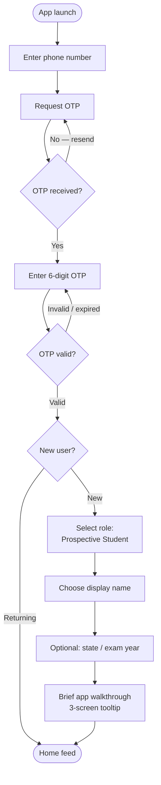

### 2.2 University Discovery

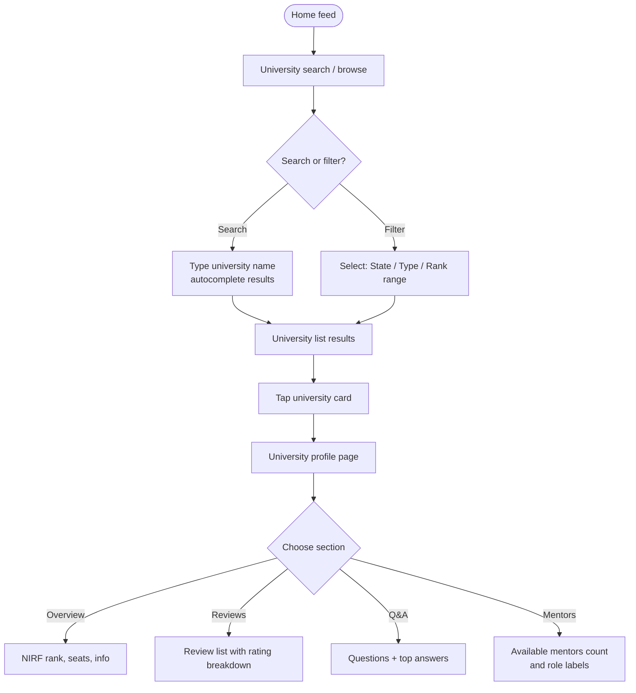

### 2.3 Ask a Question

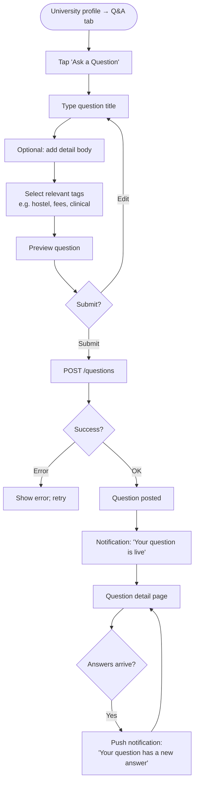

### 2.4 Initiate a Chat

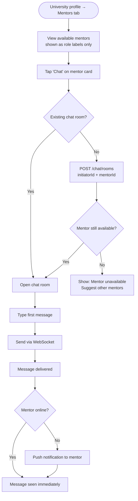

---

## 3. Current Student / Alumni Flows

### 3.1 Onboarding — Student / Alumni

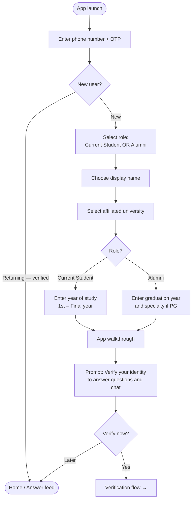

### 3.2 Verification — Submit Documents

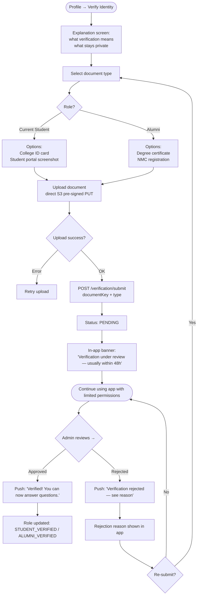

### 3.3 Answer a Question

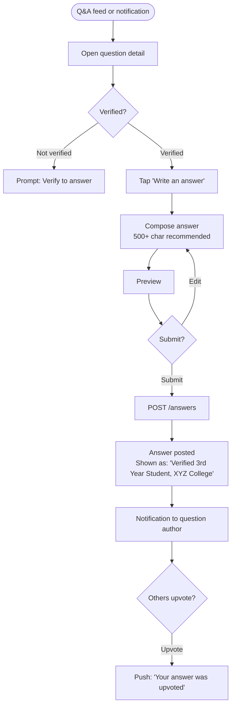

### 3.4 Receive and Respond to Chat

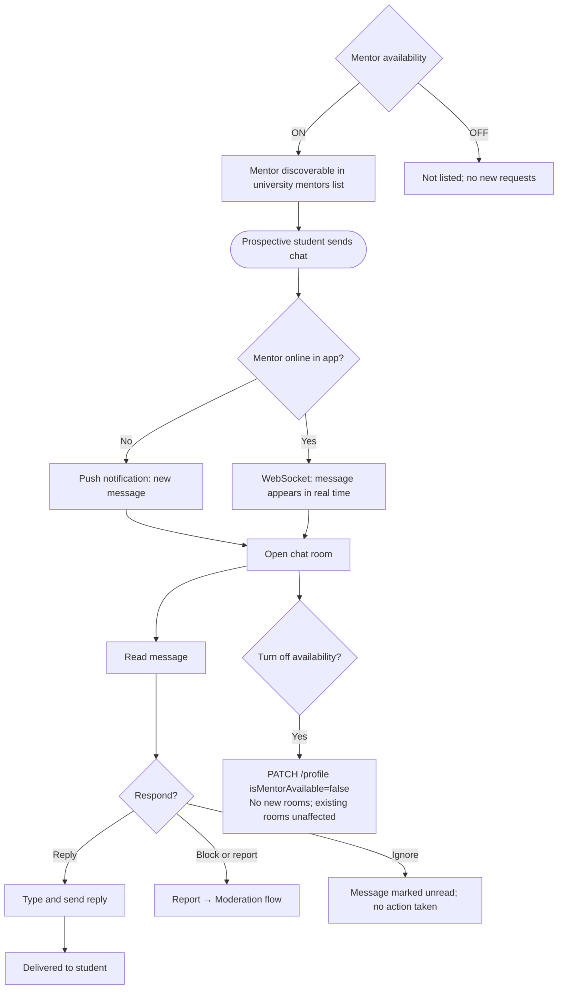

### 3.5 Write a Review

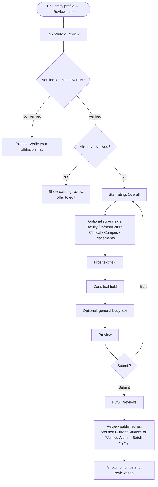

---

## 4. Admin Flows

### 4.1 Admin Onboarding

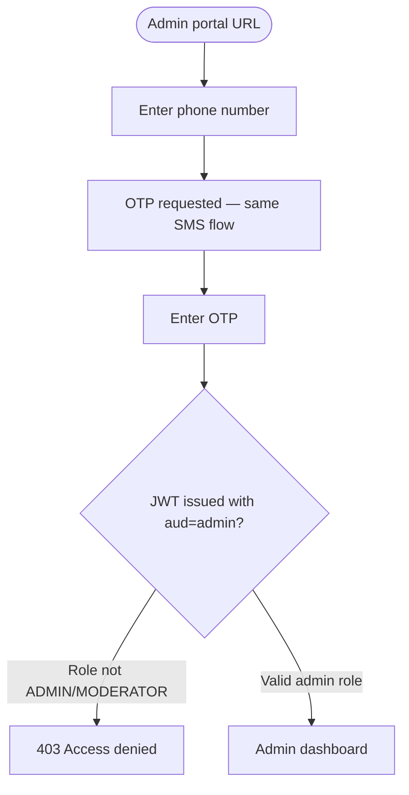

### 4.2 Verification Review Queue

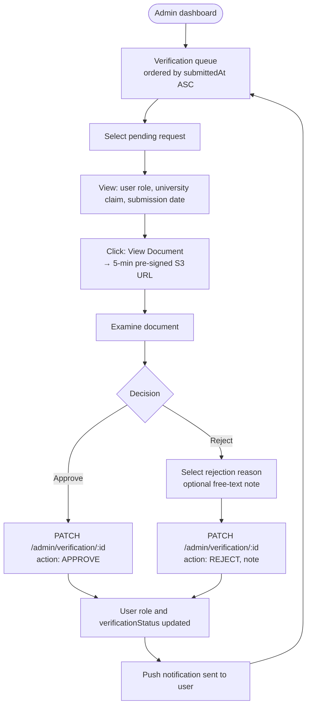

### 4.3 Content Moderation Queue

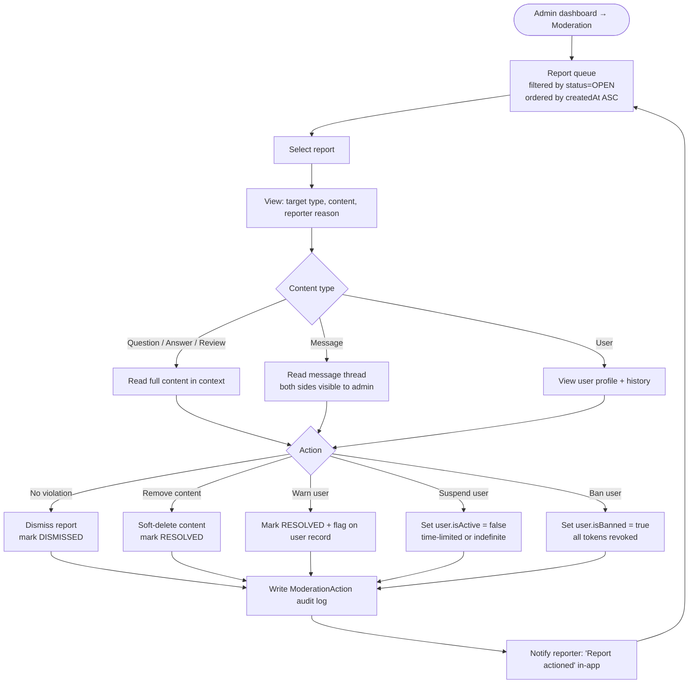

### 4.4 University Management

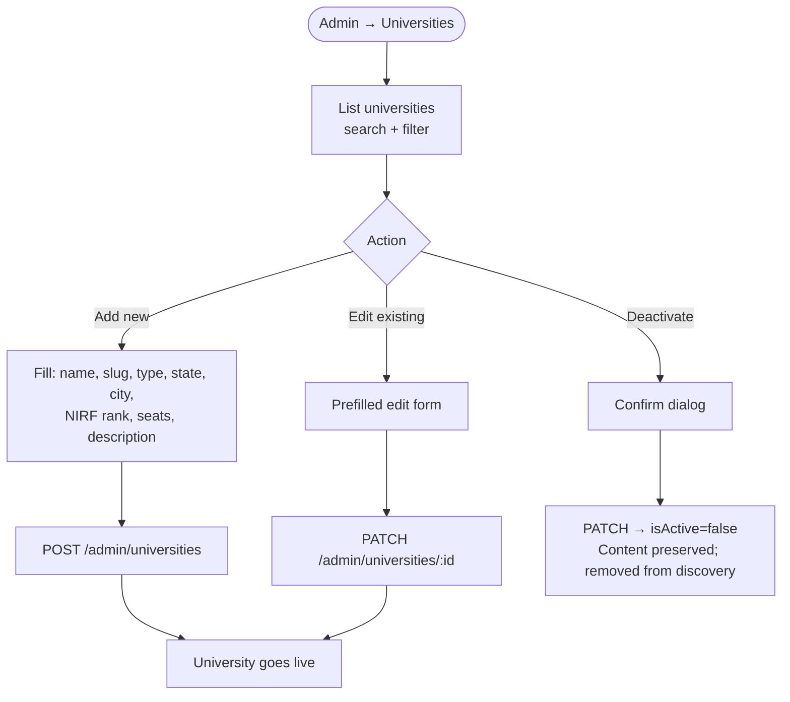

### 4.5 User Management

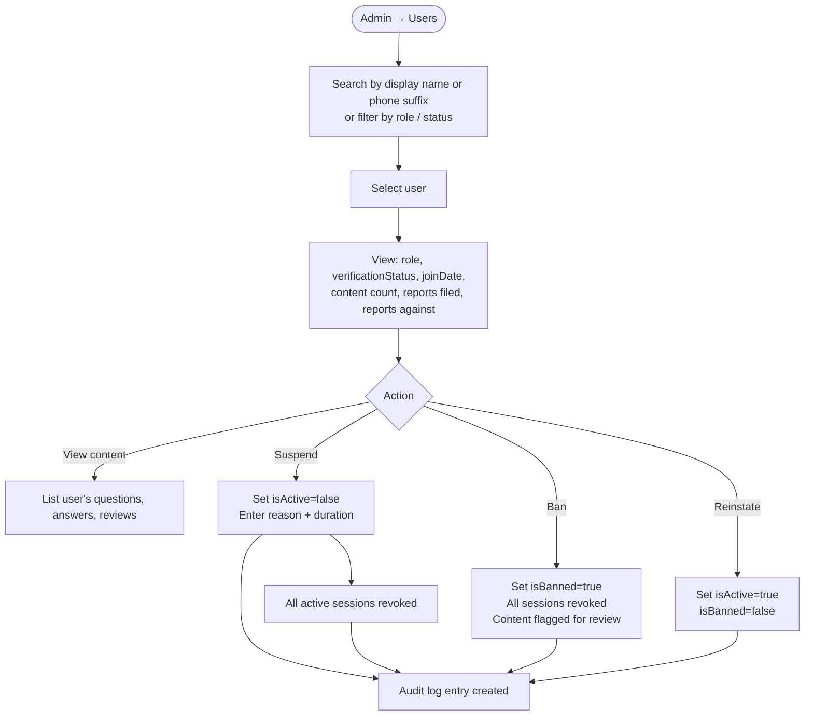

---

## 5. Cross-Cutting Flow: Push Notification Delivery

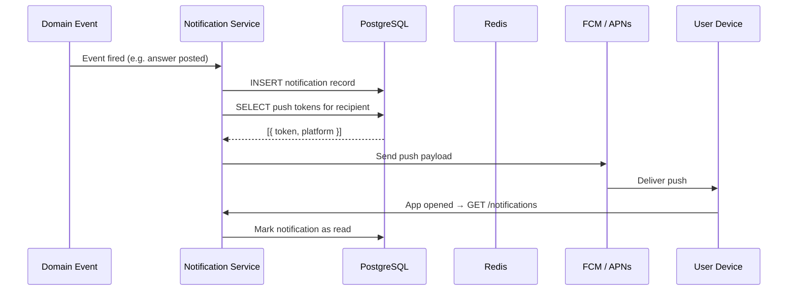

---

## 6. Flow State Summary

### User states

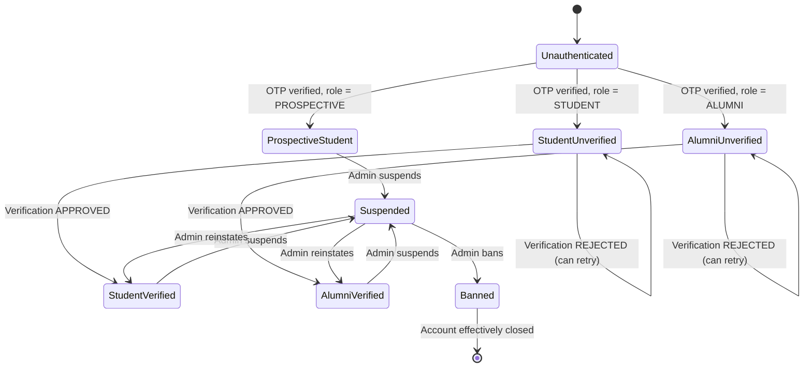

### Verification request states

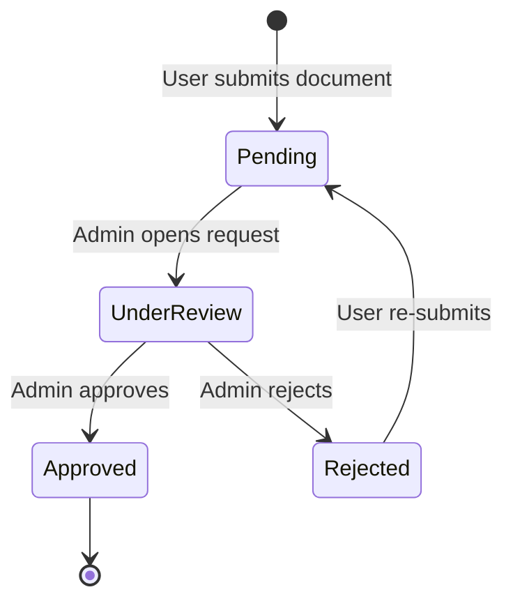

### Chat room states

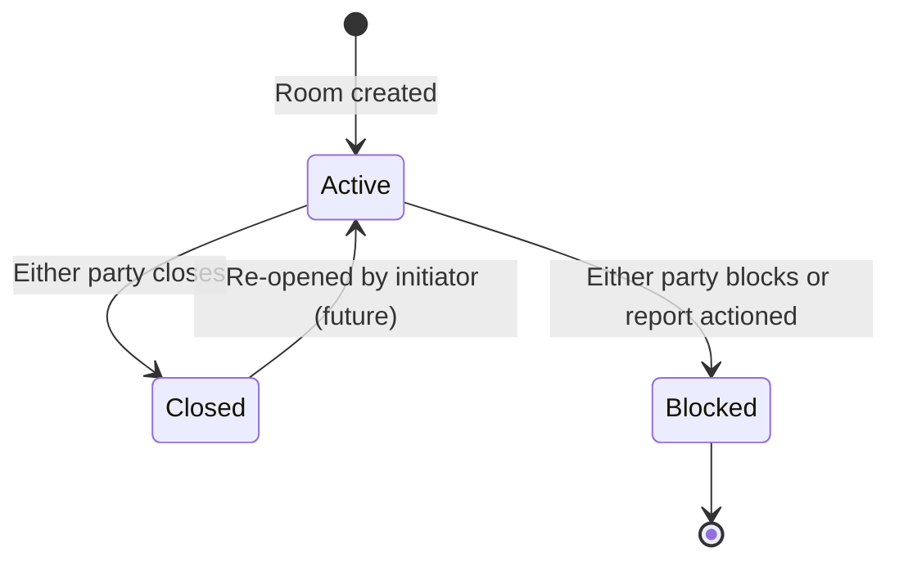
