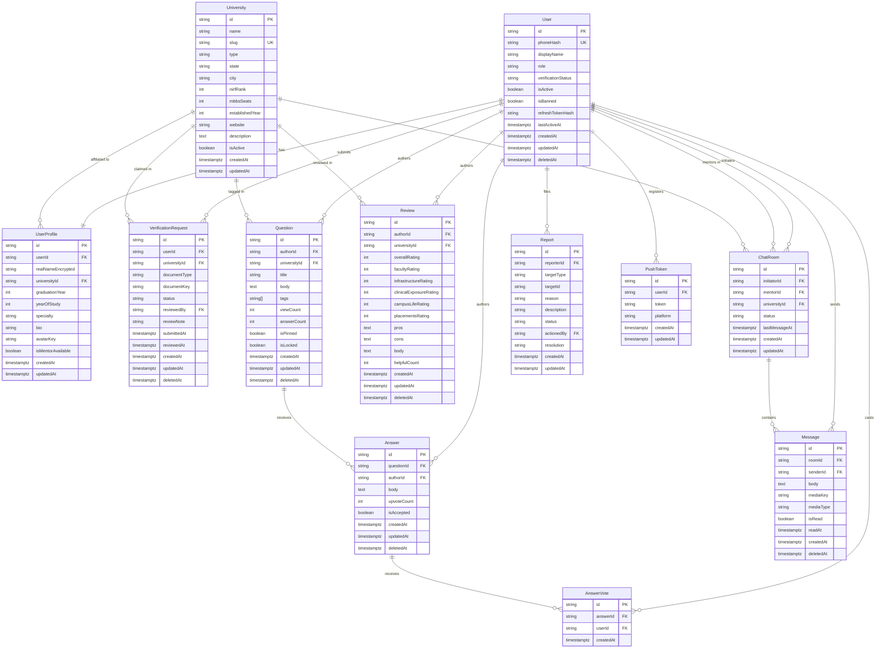
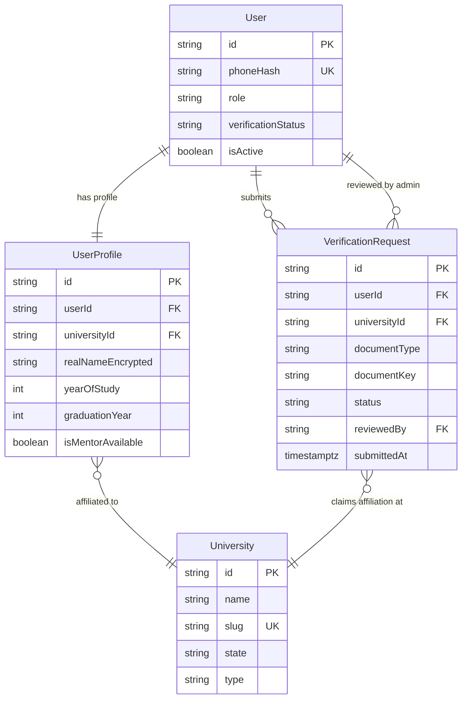
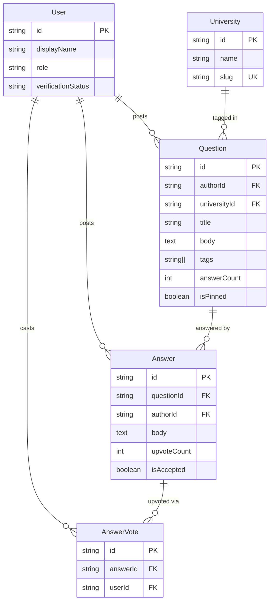
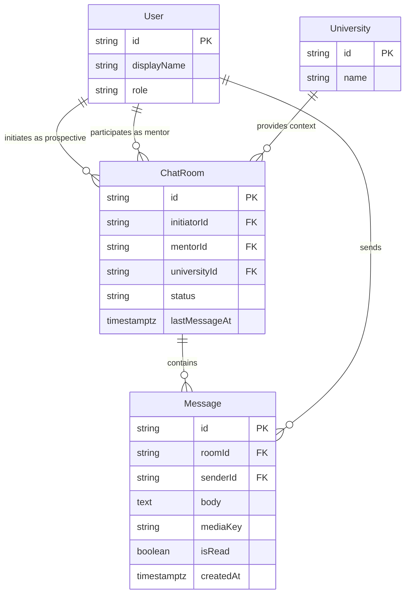
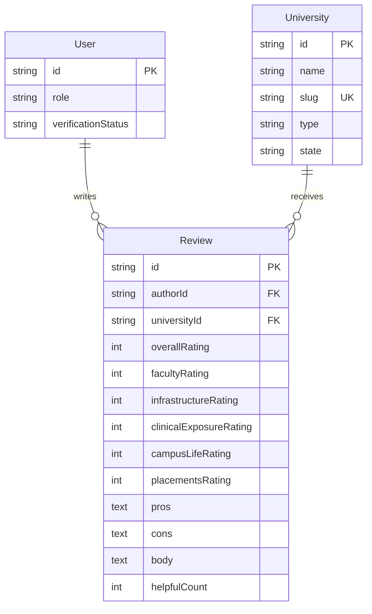
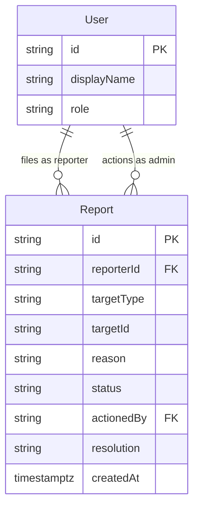
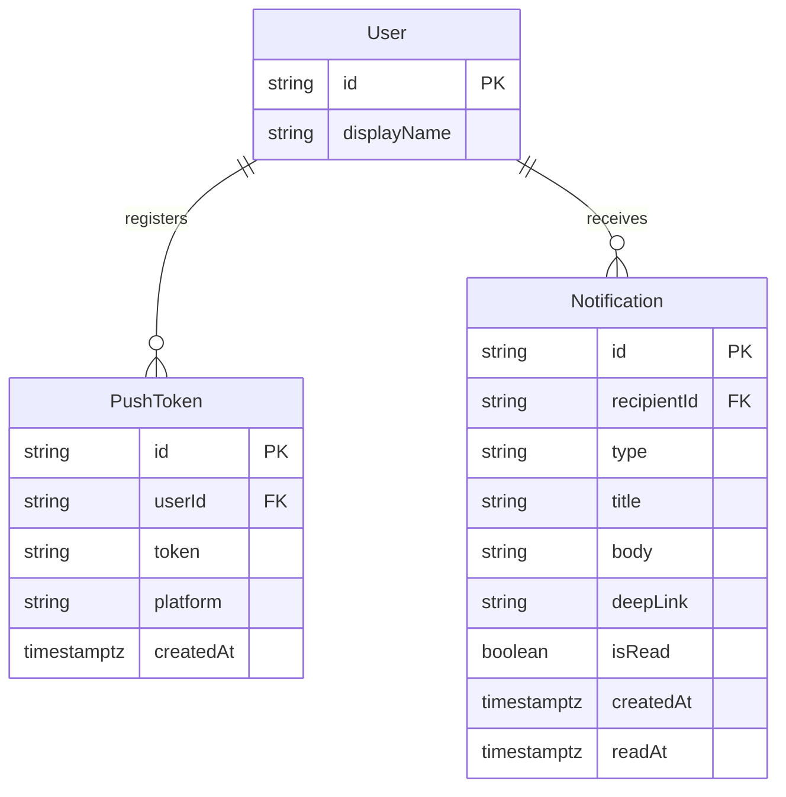

# Uniscope — Entity Relationship Diagram v1

**Version:** 1.0  
**Status:** Draft  
**Date:** 2026-06-09  
**Owner:** Engineering

---

## 1. Full Entity Relationship Diagram

---

## 2. Identity & Verification Cluster

---

## 3. Q&A Cluster

---

## 4. Chat Cluster

---

## 5. Reviews Cluster

---

## 6. Moderation Cluster

---

## 7. Notifications & Devices Cluster

