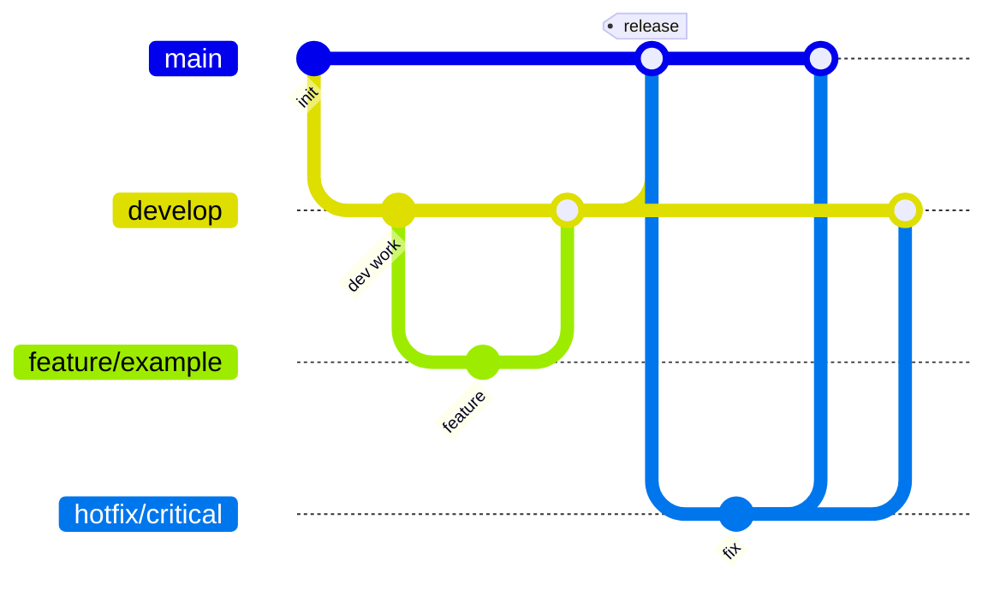

# Branch strategy

MedConnect uses a simplified Git Flow adapted for a startup monorepo.

## Branches

### `main`

- Always deployable / release-ready.
- Protected — requires PR and review.
- Receives merges from `develop` (releases) and `hotfix/*` (emergencies).

### `develop`

- Integration branch for ongoing work.
- Default branch for feature PR targets during active development.
- Should pass CI before merging features.

### `feature/*`

- Branch from: `develop`
- Merge to: `develop`
- Naming: `feature/<ticket-or-short-name>`
- Examples: `feature/auth-foundation`, `feature/admin-dashboard-shell`

### `bugfix/*`

- Branch from: `develop` (or `main` if fixing production-only config — rare in early stage)
- Merge to: same source branch
- For non-critical defects found in development or staging.

### `hotfix/*`

- Branch from: `main`
- Merge to: `main` **and** `develop`
- For critical production issues only.
- Keep changes minimal.

## Pull requests

- One PR per feature/bugfix/hotfix branch.
- Use the [PR template](../../.github/pull_request_template.md).
- Squash merge recommended for clean history.
- Delete branch after merge.

## Release cadence (future)

Tag releases on `main`: `v0.1.0`, `v1.0.0`. Document in sprint deliverables.

## Initial bootstrap

Until `develop` exists remotely:

1. Create `main` from current foundation commit.
2. Create `develop` from `main`.
3. Branch features from `develop`.
